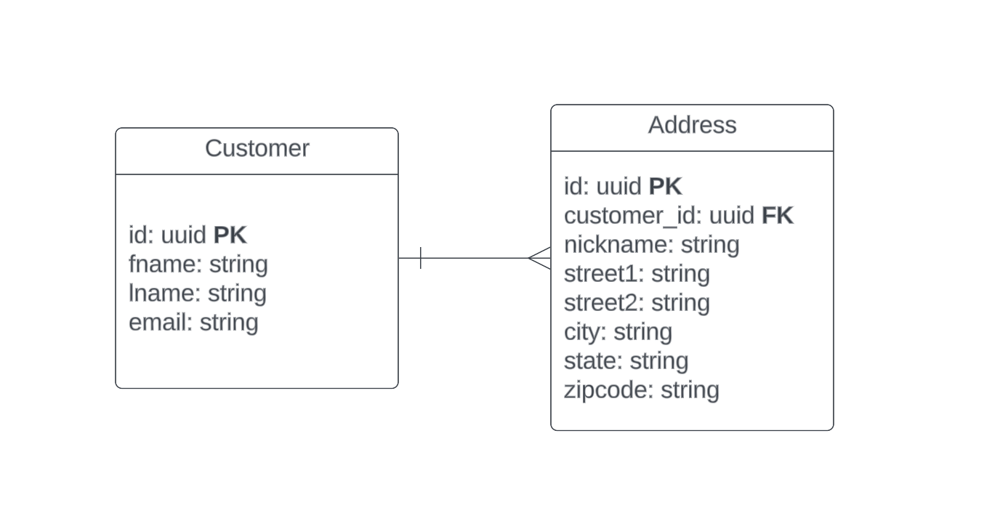
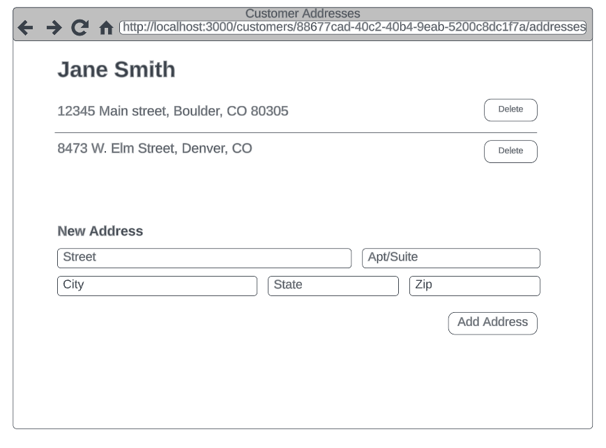

### Code-Challenge-Directions ###


### Getting Started ###

Starting this project should just require a running Docker daemon and the following commands:

AR: As a fun starter, I'm on windows. However the underlying docker commands run just fine.
### Build docker image ###
```sh
$ make build-server 
```

**Run the app using docker compose:**
```sh
$ make run
```

### Backend Assignment (Estimated the time: <3 hours)
This codebase contains an API to manage Customers. Included are the REST endpoints to manage the Customer resource (CRUD). 

Tasks:
1. The current POST route for Customers is only constrained on primary key. As such, duplicate records are allowed. The first task is to enforce uniqueness on email address and return a 422 when trying to create a duplicate customer record. You may enforce uniqueness however you like.

AR: Constrained the email by doing a lookup on the DB. I considered adding a unique key constraint as I did for the Address, but with a pre-existing database this won't work so is a good temporary fix until the data can be cleansed/migrated.

2. Each Customer resource has N Address subresources, as indicated in the model below. 


The second task is to create a RESTful CRUD interface for the Address subresource. As before, Address uniqueness should be enforced on the Customer, who may not have duplicates of the same address. Attempting to create a duplicate Address should return a 422 status code.

AR: Model created and constrained using a unique key. Alembic did not seem to want to do this using it's generate script so I added it manually.

### Frontend Assignment (Estimated the time: <3 hours)
You are to create a frontend interface to enable an user to interact with the backend API you created. You'll have to start from scratch as we have not provided a framework to work within. Please provide instructions on how to run the code you write and deliver. 

Tasks:
Using the below wireframe, create a UI that communicates with the backend API with the following functionality:
1. Display a list of addresses for a given customer
2. Delete an address for the customer
3. Add a new address the customer

No need to spend time on beautifying the UI; a functional prototype is fine. However, please do make sure that the interface is responsive and mobile-first.

AR: See Readme on included front end


